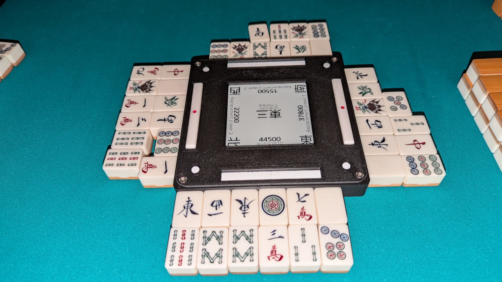
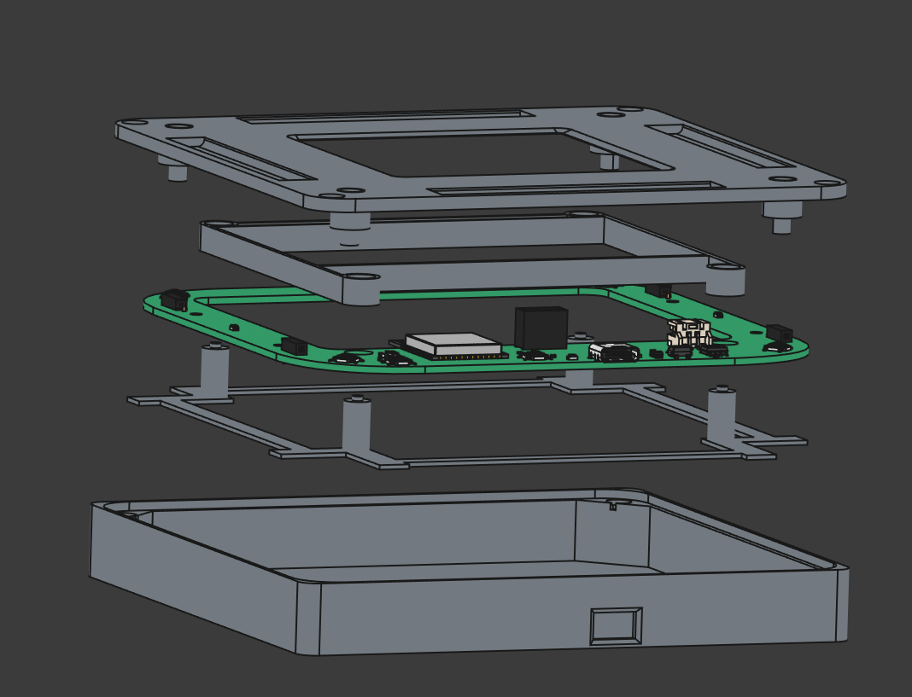

# E-ink mahjong compass

This repo contains all the files neccesary to build a bluetooth controlled digital mahjong compass.

The project is divided into the following main parts:

* [**3d**](3d): the freecad project and stl-files to 3D print the case
* [**android_app**](android_app): the android app used to control the device
* [**firmware**](firmware): firmware for the ESP32 microcontroller inside
* [**pcb**](pcb): design files for the custom PCB

Additional folders:

* [**fontconvert**](fontconvert): tool to convert fonts to C headers, so they can be used in the firmware
* [**hardware**](hardware): datasheets for parts used on the PCB

## PCB

The custom made PCB contains an ESP32-S3-WROOM1 microcontroller to talk to a phone via bluetooth and control the connected periphery.

It has the following components:

* 4.2 inch 400x300 (300x300 visible) E-ink display
* 4 buttons for controlling the device
* 4 indicator LEDs placed below the riichi bet trays of each player
* USB-C port for programming the ESP32 and charging the battery
* TP4056 module to control charging of a single cell LiPo battery via the USB-C port
* (optional and untested MAX17048 fuel gauge controller to determine the battery charge)

The production subfolder contains all the files needed to order the PCBs.
The `eink_mahjong_compass.zip` file contains alle the gerber files needed to order the PCB.
`bom.csv` and `positions.csv` are additionally needed when ordering the PCBs assembled.
The files for assembly will work for JLCPCB, other sites might need a different file format.

Even when ordering with assembly, two parts have to be soldered by hand. Those being the connector
for the E-ink display and the ESP32 module. Adding those would make the assembly service much more expensive.

## How to build

### Requirements

The following things need to be ordered:

* WeAct 4.2 inch Epaper module <https://aliexpress.com/item/1005008461198386.html> (only sold by WeAct Studio Official Store, order the black/white one, the black/red/white variant might not work)
* ESP32-S3-WROOM1-N4 <https://aliexpress.com/item/1005004815894336.html> (there are various vendors, they should all be fine. -N4 is the cheapest variant with 4MB flash and no external RAM. The better variants will probably work as well but won't provide any benefits)
* 2x 4 pin PCB Female Pin Header Socket Connector <https://aliexpress.com/item/1005004122312694.html> for the display connector
* (optional) Ntag 215 NFC tag stickers <https://aliexpress.com/item/1005006387440192.html> stick them on the underside of the lid and write the connect URL to them, so the app auto starts when touching item
* battery, either a 5000mAh 105080 or a 6000mAh 906090 can be used, other formats would need changes to the 3D printed part to hold the battery in place. Example seller <https://aliexpress.com/item/1005004639603622.html> batteries from other sellers will probably work fine as well, but a 2 pin connector is required, not a 3 pin one.
* M3xL4xOD4.2 brass insert nuts. <https://de.aliexpress.com/item/1005006472702418.html> Molded into the case to hold the lid screws
* M3 6mm countersunk screws <https://aliexpress.com/item/33006942612.html>

### Assembly

* 3D print the parts as described in [3d/README](3d/README.md).
* Using a soldering iron push the brass insert nuts into the corners of the case.
* Place the PCB on the printed `display_feet`
* Place the display_feet on top
* Put them into the case
* Place the battery inside and connect it after checking if the polarity of the connector matches that on the PCB.
* Add the screen
* Place the lid on top and screw it down.

### Flashing the firmware

To build and flash the firmware, you need to download and install  [PlatformIO](https://platformio.org/).

Then just connect the compass via USB and run `pio run --target upload` in the firmware directory.
